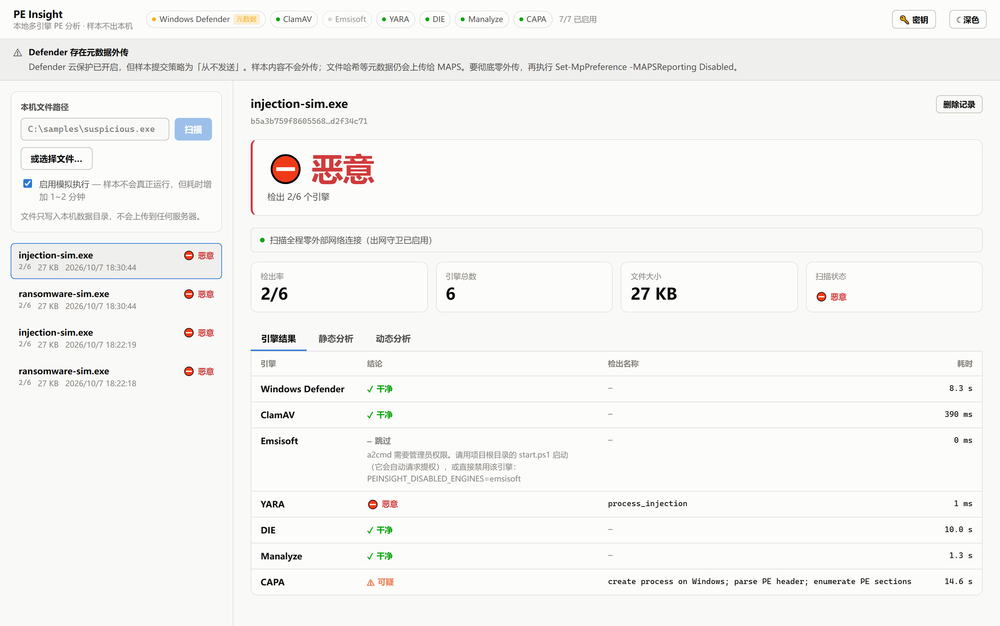
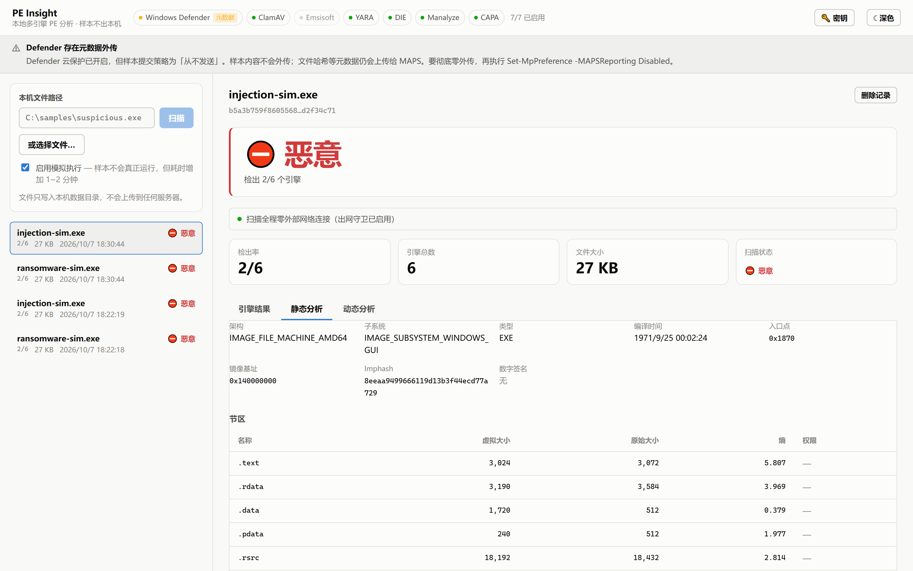
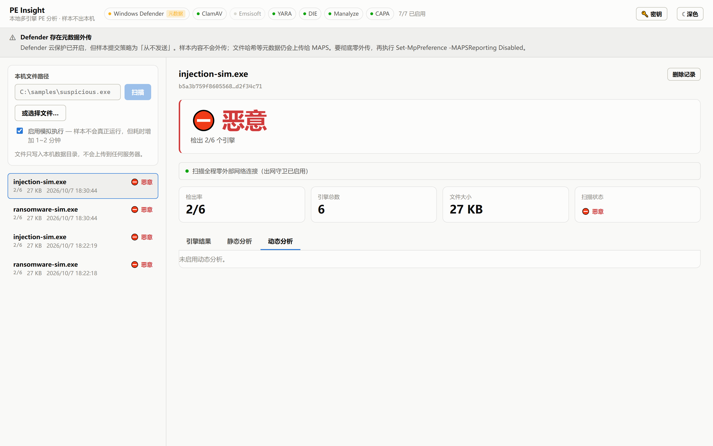
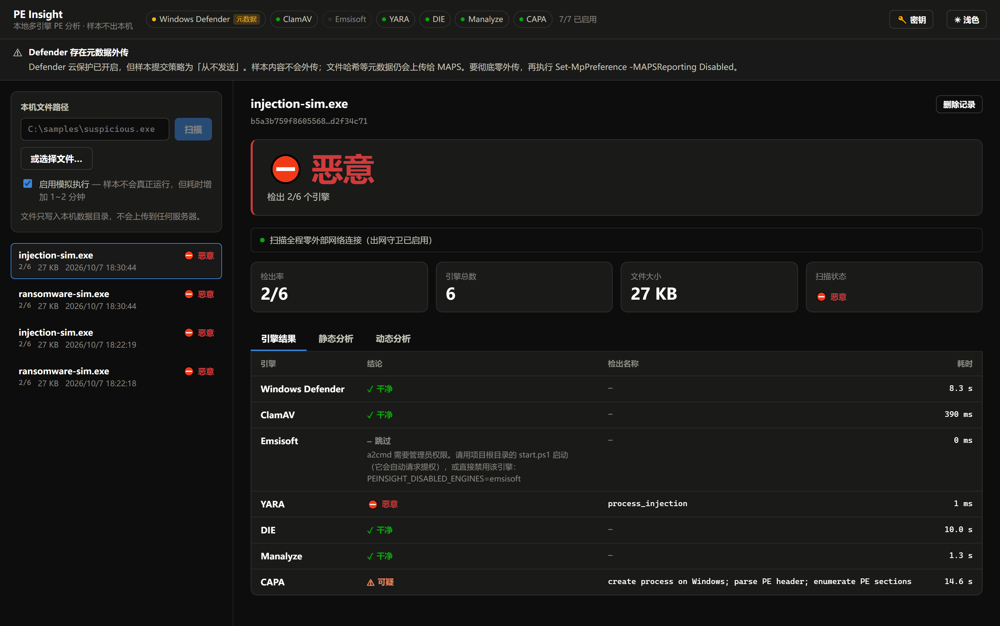

# PE Insight

本地运行的、类似 VirusTotal 的 Windows PE 文件分析工具。
**样本永不离开本机。**

三层检测：多引擎签名查杀 + PE 静态结构分析 + Speakeasy 模拟执行。
带 Web UI、命令行，以及**供内网其他机器调用的 HTTP API**。

---

> ### ⚠️ 平台要求
>
> **仅支持 Windows 10/11。** 本项目依赖 Defender 的 `MpCmdRun.exe`、
> 系统防火墙和 `Get-MpPreference`，无法在 Linux / macOS 上运行。
>
> 需要：**Windows 10 1809+**、**管理员权限**（Emsisoft 引擎要求）、
> 首次安装约 **2.5 GB** 磁盘空间（分析引擎）。
>
> ### ⚠️ 许可证
>
> 本项目代码为 [MIT](LICENSE)。但**集成的第三方引擎各有自己的许可证**，
> 其中需要特别注意：
>
> | 引擎 | 许可证 | 注意 |
> |---|---|---|
> | **Emsisoft EEK** | 专有 | **仅限私人非商业使用**。商用需购买授权，或用 `PEINSIGHT_DISABLED_ENGINES=emsisoft` 关掉它 |
> | **ClamAV** | GPL-2.0 | 以独立进程调用，不链接其代码；按其自身条款分发 |
> | Manalyze | GPL-3.0 | |
> | 其余（YARA / DIE / CAPA / Speakeasy） | MIT / BSD / Apache-2.0 | 宽松 |
>
> 完整声明见 [LICENSE](LICENSE) 末尾的 THIRD-PARTY NOTICES。

> 内网多机共用请见 **[API.md](API.md)** —— 接口清单、鉴权、完整调用示例、
> 防火墙配置都在那里。

---

## 界面

分析结果页。上方是**结论**和**网络隔离状态**，下面是**每个引擎各自的结果**——
这是"多引擎"的核心价值：能看出是哪个引擎抓到的、哪个漏了。



<details>
<summary>静态分析（PE 结构、节区熵、导入表）</summary>



</details>

<details>
<summary>动态分析（模拟执行的 API 调用序列、ATT&amp;CK 映射、提取出的 IOC）</summary>



</details>

<details>
<summary>深色模式</summary>



</details>

> 截图里跑的是人工构造的合成样本（只有字符串，不含可执行恶意代码），
> 用来演示检出链路。生成它的脚本已随 demo 功能一并移除，截图本身仍在。

---

## 快速开始

**三步：clone → 装 → 跑。**

```powershell
git clone https://github.com/Zephyr236/pe-insight.git
cd pe-insight

.\setup.ps1          # 或双击 setup.bat —— 装依赖 + 下载分析引擎
.\start.ps1          # 或双击 start.bat —— 启动并打开浏览器
```

就这些。`setup.bat` / `start.bat` 双击即可，不用开命令行。

### setup 会做什么

| 步骤 | 说明 |
|---|---|
| 检查环境 | 确认是 Windows；没有 `uv` 会询问是否自动安装 |
| Python | 装 Python 3.11 + 虚拟环境 + 依赖（约 100 MB） |
| 前端 | 使用仓库自带的构建产物（`frontend/dist/`），**不需要 Node.js** |
| 分析引擎 | 下载 ClamAV / Emsisoft / DIE / Manalyze / CAPA（约 2.5 GB） |
| YARA 规则 | 下载 signature-base 规则集（747 个文件，约 9 MB） |

**不需要管理员权限。** 最耗时的是最后一步，会先问你一次再开始。

常用参数：

```powershell
.\setup.ps1 -SkipTools      # 只装代码依赖，不下载 2.5 GB 引擎
.\setup.ps1 -BuildFrontend  # 从源码重建前端（改 frontend/src/ 时才需要，要 Node.js）
.\setup.ps1 -Force          # 强制重跑所有步骤
.\setup.ps1 -Yes            # 全程不提问，一律按"是"处理
```

`-Yes` 供无人值守安装使用（CI、批量部署、脚本里调用）。默认情况下脚本会在
**自动安装 uv** 和**开始下载 2.5 GB 引擎**前各问一次，加了 `-Yes` 就都不再
提问、直接继续。`setup.bat` 会把参数透传，所以 `setup.bat -Yes` 同样有效。

### start 会做什么

1. **自动请求管理员权限**（弹 UAC，点「是」）
2. 自动放行防火墙端口（仅专用网络）
3. 清理残留的旧实例，避免端口占用
4. 启动服务、等就绪、打开浏览器

> **为什么要管理员**：
> 1. Emsisoft 的 `a2cmd.exe` **拒绝在非提升会话下扫描**（退出码 9「需要更高权限」）
> 2. 对内网开放需要配置防火墙入站规则
> 3. Defender 的 `MpCmdRun` 在提升会话下行为更稳定
>
> 直接跑 `python -m app.cli serve` 也能启动，但会打印权限警告且 Emsisoft 会失效。

启动后打开 <http://127.0.0.1:8080>。要给内网其他机器用，见 [API.md](API.md)。

打开 <http://127.0.0.1:8080>。

> `setuptools<81` 不是可选项：Speakeasy 依赖的 `distorm3` 需要 `distutils`，
> 而 setuptools 81+ 已将其移除。

### 先验证它真的在工作

```powershell
cd backend
.\.venv\Scripts\python.exe -m app.cli selftest    # 引擎是否真的在查杀
.\.venv\Scripts\python.exe -m app.cli verify-offline  # 实测断网可行性
```

**`selftest` 是最快看到效果的方式**——它用 EICAR 测试串逐引擎验证，
确认每个引擎真的在查杀而不是"沉默地失败"。

扫干净的系统文件是看不出任何东西的：所有引擎都会说"干净"。要看真实的
检出效果，拿一份真实样本来扫（先把 `data/` 加进 Defender 排除列表）。

---

## 命令一览

| 命令 | 作用 |
|---|---|
| `scan <路径>` | 扫描文件（`--no-dynamic` 跳过模拟执行，`--json` 输出完整报告） |
| `serve` | 启动 Web 服务 |
| `engines` | 查看各引擎状态（含被安全策略排除者及原因） |
| `selftest` | 用 EICAR 验证引擎是否真的在查杀 |
| `verify-offline` | 实测出网拦截与断网可行性 |
| `privacy` | 审计样本外传通道 |
| `setup-clamav` | 下载配置 ClamAV 便携版（`--force` 重下，`--skip-db` 跳过签名库） |
| `setup-emsisoft` | 下载配置 Emsisoft Emergency Kit（同上开关） |
| `setup-tools` | 下载配置 DIE / Manalyze / CAPA（开源、本地、免费） |
| `setup-yara` | 下载 signature-base YARA 规则集（5000+ 条，开源） |
| `update` | 更新签名库与规则集（`--check` 只看新鲜度，`--only X,Y` 指定组件，`--if-stale-hours N` 只更新过期的） |
| `clamd start\|stop\|status` | 管理 ClamAV 守护进程（把扫描从 ~3s 降到 ~130ms） |
| `setup-exclusions` | 把数据目录加入 Defender 排除列表（**分析真实样本的前提**） |
| `purge-samples` | 清空已存样本（扫描报告保留） |

---

## 引擎层

### 签名引擎（比对已知特征）

| 引擎 | 已安装 | 外传等级 | 说明 |
|---|---|---|---|
| **ClamAV** | 需安装 | 完全本地 | `setup-clamav` 一键装；有守护进程时走 clamdscan |
| **Emsisoft** | 需安装 | 完全本地 | `setup-emsisoft` 一键装 EEK；扫描固定传 `/cloud=0` |
| **YARA** | 需下规则 | 完全本地 | 规则集 `setup-yara` 一键装（signature-base，5200+ 条）；自有规则放 `rules/` |
| **YARA-X** | 需下规则 | 完全本地 | VirusTotal 的 Rust 重写版，跑**同一批规则**，与 YARA 互为交叉验证 |

> YARA 和 YARA-X 同属一个"来源"：聚合判定时只算一票，否则同一份规则的
> 一次命中会被数成两个引擎，检测比例虚高。引擎各自的结论仍如实列出。

规则加载 **746/747 个文件**。其中 13 个文件（652 条规则）依赖外部变量
（`filename` / `filepath` / `extension` / `filetype`），两个引擎都会把
实际文件名等信息填进去——这批规则做的是**伪装检测**：文件叫
`svchost.exe` 但长得不像真的、PE 挂着 `.jpg` 后缀、改名的已知脆弱驱动
（BYOVD）等等。
| **Windows Defender** | 开箱可用 | **仅元数据** | `MpCmdRun.exe`。取决于系统设置，运行时查证 |

### 结构 / 能力分析（不看签名，看"是什么"和"能干什么"）

| 工具 | 已安装 | 说明 |
|---|---|---|
| **DIE** | 需安装 | 加壳器/编译器/保护器识别。**自定义字节码虚拟机这类样本，签名引擎全失明，DIE 是唯一线索来源** |
| **Manalyze** | 需安装 | PE 结构分析：加壳痕迹、可疑导入、内嵌加密常量、**勒索钱包地址** |
| **CAPA** | 需安装 | 能力识别 + ATT&CK 映射。签名引擎问"像不像已知的坏东西"，CAPA 问"**这段代码能干什么**" |

**为什么加这三个**：签名引擎有个共同盲区——它们看的都是"这个文件像不像已知的坏东西"。
再加第四个签名引擎边际收益很低。而这三类检出的是**完全不同的东西**。

实测一个用了自实现字节码虚拟机的样本：

```
Windows Defender  干净      ClamAV      干净      Emsisoft   干净
YARA              干净      DIE         干净      Manalyze   干净
CAPA              可疑  ← allocate or change RWX memory
```

**6 个签名引擎全军覆没，CAPA 一招命中**——因为那个 VM 必须分配可读写可执行内存
才能把字节码写进去执行。这是结构性证据，签名库再全也抓不到。

三者都是开源、免费、无试用期、无授权限制、完全本地。

> Manalyze 自带一个 `plugin_virustotal.dll`。`setup-tools` 会**直接物理删除**它——
> 它是上传通道，留着就等于给"样本不外传"开了个口子，哪怕默认不启用也不放心。

## 引擎授权：哪些能一直用

只有这几个是**免费且无时间限制**的：

| 引擎 | 免费形式 | 使用限制 |
|---|---|---|
| Windows Defender | 系统自带 | 无 |
| ClamAV | 开源 GPL | 无 |
| YARA | 开源 BSD | 无 |
| **Emsisoft EEK** | 免费版 | **仅限私人/非商业用途**，无时限 |

Emsisoft EEK 的授权原文（随包附带）：

> Products and product editions marked as "freeware" must be used exclusively
> by you or members of your household solely for **private non-commercial purposes**,
> and commercial use requires the express written consent of the Licenser.

配置里也能验证没有期限：`Ends=32503680000`（约公元 3000 年）。

**商业引擎**（ESET `ecls.exe`、Kaspersky `avp.com`、Bitdefender 等）的 CLI
确实随产品安装后自带，但**没有免费长期版本**——只有 30 天试用。而且
**一台机器上只能有一个带实时防护的引擎**：装第一个第三方杀软时 Windows
会自动把 Defender 切到被动模式（这是微软支持的正常组合），但第二个
就会争抢文件系统驱动，导致扫描死循环、文件锁死甚至蓝屏。

要接商业引擎，正确做法是**一引擎一隔离 VM**，走 `RemoteVmEngine` 适配器。

### Emsisoft 的 `/cloud=0` 是关键

a2cmd 的帮助里写着云端请求**默认为开启**：

```
/cloud=[]    If it is "1" then scanner will use cloud requests (default value is "1")
```

也就是说，不加参数的话它会把文件信息发往 Emsisoft 云端。本产品固定传
`/cloud=0`，扫描完全本地。同时**刻意不加 `/d`（删除）和 `/q=`（隔离）**
——a2cmd 默认只报告、不碰文件，这样后续引擎和动态分析才拿得到样本。

### 网络策略：把"不外传"拆成可判定的等级

"不外传"不是一个布尔值。实测下来至少有三个不同强度的事实状态，混成一个开关
会导致要么过度保守（能用的引擎被禁），要么过度宽松（把"仅元数据外传"说成
"完全本地"）：

| 等级 | 含义 |
|---|---|
| `local` | 可证明不产生任何外部网络行为 |
| `metadata` | 不外传样本内容，但会外传哈希/文件名等元数据 |
| `sample` | 可能外传样本内容本身 |

由 `PEINSIGHT_NETWORK_POLICY` 决定允许到哪一级：

| 策略 | 允许的等级 | 适用场景 |
|---|---|---|
| `local` | 仅 `local` | 最严，要求零外传 |
| **`no-sample`**（默认） | `local` + `metadata` | 对应「样本不上传云端」的要求 |
| `any` | 全部 | 不限制 |

`engines` 命令会列出每个引擎的**实际等级**和它被排除的原因：

```
网络策略：允许不外传样本内容的引擎（PEINSIGHT_NETWORK_POLICY=no-sample）

引擎                   已安装      本次启用       外传等级           说明
Windows Defender     是        是          仅元数据           样本内容不会外传…文件哈希等元数据仍会上传
ClamAV               是        是          完全本地
YARA                 是        是          完全本地
```

### Windows Defender 是怎么调的，以及为什么默认不用它

调用方式是单文件按需扫描：

```
MpCmdRun.exe -Scan -ScanType 3 -File <样本路径> -DisableRemediation
```

`-DisableRemediation` 是必需的，否则 Defender 会把样本直接隔离或删除，
后续引擎和动态分析就拿不到文件了。退出码 `0` = 无威胁，`2` = 检出威胁。

**但它能不能保证不外传，本产品管不了。** 原因有两层：

1. **出网守卫对它无效。** `netguard` 劫持的是 **Python 的 socket 层**，
   而 `MpCmdRun.exe` 是独立的原生进程（它还会把扫描请求转交给 Defender
   服务 `MsMpEng.exe` 执行）。Python 层面的拦截对原生进程毫无作用。
   扫描报告里那句"零外部网络连接"，测的是**本产品自己的代码**，
   不覆盖 Defender 自身的网络行为。

2. **它的外传通道由系统设置决定**，实测本机为：

   ```
   MAPSReporting        = 2   云保护＝高级（会提交可疑文件）
   SubmitSamplesConsent = 1   自动发送安全样本
   ```

   `SubmitSamplesConsent=1` 的含义是"自动发送**不含 PII** 的样本"——
   注意它不等于"只发恶意样本"，被判为安全的文件同样可能被送出去；
   而开启 MAPS 本身就会上传文件哈希等元数据。

所以适配器不写死等级，而是**运行时查证**系统设置，按实情归类：

| Defender 设置 | 判定的等级 |
|---|---|
| 云保护关闭 | `local` |
| 云保护开启 + 样本提交「从不发送」 | `metadata` |
| 云保护开启 + 会提交样本 | `sample` |
| 读不到设置 | `sample`（按最坏情况处理） |

三条可选路径：

```powershell
# A. 只关样本上传（推荐）——保留云保护，样本内容不外传，但哈希等元数据仍会传给 MAPS
Set-MpPreference -SubmitSamplesConsent NeverSend

# B. 彻底零外传 —— 连元数据也不传，但会削弱系统防护
Set-MpPreference -MAPSReporting Disabled
Set-MpPreference -SubmitSamplesConsent NeverSend

# C. 维持现状并放宽策略，明确接受样本可能被上传
$env:PEINSIGHT_NETWORK_POLICY = 'any'
```

> 顺带一个实证：本产品的 `demo` 生成的合成勒索样本，被 Defender 的实时防护
> 直接隔离了（`Trojan:Win32/Malgent`）。这说明它是真的在工作，也说明
> 未排除的目录里任何它检出的文件都会被拿走。

### 签名库更新

**只有 Windows Defender 会自动更新**（Windows 自己管）。其余组件装完之后
不会自己变新——实测装完几天后 DIE 的检测库已经陈旧了 800 天。

所以有两层更新机制：

**① 手动**

```powershell
python -m app.cli update --check              # 先看有多旧
python -m app.cli update                      # 更新全部
python -m app.cli update --only clamav,capa   # 只更新指定组件
```

**② 服务启动时后台自动更新（默认开启）**

服务启动 45 秒后在后台线程里检查各组件，**只更新超过 24 小时的**。
这个阈值是必需的——否则重启十次服务就会下载十次上百 MB 的签名库。

关掉它：

```powershell
$env:PEINSIGHT_AUTO_UPDATE = "0"
```

更新需要联网，但和「扫描期间强制断网」不冲突：更新下载的是**签名**而非样本，
而且走独立进程，不经过扫描时的出网守卫。

### 关于「样本会留在磁盘上」

工具默认把样本按 SHA256 存进 `data/samples/`，便于重复分析与重跑。
但真实恶意样本长期留在磁盘上是有风险的，尤其 `data` 已被加入 Defender
排除列表（那里不受实时防护保护）。分析完及时清空：

```powershell
python -m app.cli purge-samples --yes    # 删样本，扫描报告保留
```

### 关于"再多装几个杀毒引擎"

**不能把多个实时防护杀软装在同一台 Windows 上。** 它们会争抢文件系统
微过滤驱动和 API Hook，导致扫描死循环、文件锁死、误报甚至蓝屏
（Broadcom、微软、ESET 文档均明确要求同一时间只运行一个实时防护引擎）。

要接商业引擎（ESET `ecls.exe`、Kaspersky `avp.com`），必须**一引擎一隔离 VM**。
所以引擎被设计成适配器，本机进程引擎和 VM 内引擎走同一套接口：

```python
class EngineAdapter(ABC):
    def available(self) -> bool: ...
    def scan(self, ctx: ScanContext) -> EngineResult: ...
```

新增引擎只需在 `backend/app/engines/` 加一个模块，然后在 `registry.py`
的 `build_engines()` 里登记。VM 引擎和本机引擎对上层完全同构，零重构。

**但要清楚**：再加签名引擎救不了新型/加壳样本——它们看的是同一类特征。
YARA 规则质量和模拟执行深度，比堆引擎数量更影响实战效果。

不过**规则质量这件事本项目不自己扛**：早期试过手写规则，19 条里有 8 条在
系统文件上误报（6.5%）——"API 存在性"这种判据根本立不住。现在直接消费
第三方维护的 [signature-base](https://github.com/Neo23x0/signature-base)
（5200+ 条，误报 0/124），本项目的定位是规则集的**消费者和调度者**，
不是规则作者。

---

## 样本不会离开本机

这不是一句承诺，是**三层机制 + 可自查**。

### 第一层：架构上就没有外传路径

所有引擎都在本机以子进程方式执行，代码里**没有任何**"上传样本给云端分析"
的逻辑。各引擎的实际外传行为都经过实测并如实声明：

| 引擎 | 外传等级 | 依据 |
|---|---|---|
| **ClamAV** | 完全本地 | 开源可审计；签名库本地加载 |
| **YARA** | 完全本地 | 进程内规则匹配 |
| **DIE** | 完全本地 | 静态结构识别 |
| **Manalyze** | 完全本地 | **自带的上传插件已在安装时物理删除** |
| **CAPA** | 完全本地 | 静态反汇编 + 规则匹配 |
| **Speakeasy** | 完全本地 | 模拟执行，网络也是模拟的 |
| **Emsisoft** | 完全本地 | 扫描固定传 `/cloud=0`（它默认会走云端） |
| **Windows Defender** | **仅元数据** | 见下方「唯一的例外」 |

> Manalyze 自带一个 `plugin_virustotal.dll`。`setup-tools` 会**直接删掉它**——
> 留着就等于给"样本不外传"开了个口子，哪怕默认不启用也不放心。

### 第二层：扫描期间强制拦截出网

**出网守卫**（`backend/app/netguard.py`）在扫描期间劫持 Python 的 socket 层，
只放行回环地址（`127.0.0.0/8`、`::1`），任何指向外部主机的**连接和 DNS 解析**
都会被拦截并记录。违规记录会写进扫描报告，UI 上显示为：

```
● 扫描全程零外部网络连接（出网守卫已启用）
```

**你可以自己验证它真的有效**：

```powershell
python -m app.cli verify-offline
```

实测输出：

```
=== 1. 出网守卫实测 ===
  拦截外部连接 : 通过 — 守卫有效，已拦截：已拦截外部连接 → example.com
  放行回环连接 : 通过 — 回环连接正常放行

=== 2. Defender 外传通道 ===
  云保护       : 高级（会提交可疑文件）
  样本提交     : 从不发送（推荐用于离线分析）
  [!] Defender 可能把样本提交给微软——本产品无法拦截此通道

=== 3. 实际扫描中的出网尝试 ===
  守卫已启用   : True
  出网尝试次数 : 0

扫描全程未产生任何外部网络连接。
```

**这个命令会真的发起一次外部连接**，验证守卫拦得住——一个"应该能拦住"的
守卫如果实际拦不住，比没有守卫更危险，因为它会给人虚假的安全感。

### 第三层：如实报告拦不住的通道

```powershell
python -m app.cli privacy
```

它会把 Defender 的云保护设置查出来并说明：

```
Windows Defender：
  云保护 (MAPS)      : 高级（会提交可疑文件）
  样本提交策略       : 从不发送（推荐用于离线分析）
  存在外传通道       : 否

本产品自身组件（不会外传）：
  ClamAV               完全本地
  YARA                 完全本地
  Speakeasy 模拟执行   完全本地
  静态分析             完全本地
```

### 唯一的例外：Windows Defender

**必须说清楚**：Defender 的云保护（MAPS）可能把文件**元数据**（哈希等）
上传给微软。这是微软的行为，**本产品的出网守卫拦不住它**——因为
`MpCmdRun.exe` 是独立的原生进程，Python 层的 socket 劫持对它无效。

默认配置下（`SubmitSamplesConsent = NeverSend`）**样本内容不会外传**，
只有元数据会。要连元数据也不传，二选一：

```powershell
# A. 关掉 Defender 的云通道（会削弱系统防护，自行权衡，需管理员）
Set-MpPreference -MAPSReporting Disabled
Set-MpPreference -SubmitSamplesConsent NeverSend

# B. 直接不用这个引擎
$env:PEINSIGHT_DISABLED_ENGINES = "windowsdefender"
```

### 网络策略：按需收紧

`PEINSIGHT_NETWORK_POLICY` 控制允许哪些外传等级的引擎参与扫描：

| 策略 | 允许的等级 | 说明 |
|---|---|---|
| `local` | 仅完全本地 | 最严，零外传。Defender 会被自动排除 |
| **`no-sample`**（默认） | 本地 + 仅元数据 | 样本内容不外传 |
| `any` | 全部 | 不限制 |

被策略排除的引擎会**如实列在 `/api/engines` 里并说明原因**，不会悄悄消失：

```powershell
python -m app.cli engines
```

```
引擎                   已安装   本次启用   外传等级      说明
Windows Defender     是      否        仅元数据      当前网络策略为「允许不外传样本内容的引擎」，…
ClamAV               是      是        完全本地
Emsisoft             是      是        完全本地      扫描时使用 /cloud=0，完全本地
...
```

---

## 隐私与断网（进阶）

这是本产品最核心的承诺，所以它被做成了**可验证的机制**而不是文档里的一句话。

### 出网守卫（netguard）

扫描全程在 socket 层强制拦截：只放行回环地址（`127.0.0.0/8`、`::1`），
任何指向外部主机的连接和 DNS 解析都会被拦截并记录。

```powershell
python -m app.cli verify-offline
```

实测输出（本机）：

```
拦截外部连接 : 通过 — 守卫有效，已拦截：已拦截外部连接 → example.com
放行回环连接 : 通过 — 回环连接正常放行
实际扫描中的出网尝试 : 0 次
扫描全程未产生任何外部网络连接。
```

扫描报告里也会带上这个记录，UI 上显示为"扫描全程零外部网络连接"。

### ⚠ 一个必须知道的例外：Windows Defender

**Microsoft Defender 的云保护（MAPS）会把可疑样本提交给微软。**
这是微软的功能，不是本产品的代码，**本产品拦不住它**。

本机实测状态：

```powershell
python -m app.cli privacy
```

```
云保护 (MAPS)      : 高级（会提交可疑文件）
样本提交策略       : 自动发送安全样本
存在外传通道       : 是
```

**本产品的处理方式是默认不用它**：`offline_only=True`（默认）会跳过任何
无法证明不外传的引擎，Defender 因此在默认配置下不参与扫描。CLI 和 UI 都会
明确列出"已安装但未启用"及其原因，而不是悄悄消失。

这样默认配置就能做到字面意义上的零外传：ClamAV + YARA + Speakeasy 全部本地，
再加上出网守卫覆盖本产品自身的代码路径。

要用回 Defender，见上一节的两条命令。**决策权在你**：关闭云通道会削弱系统
防护，而接受云通道则违背"样本不外传"的初衷——这是个真实的取舍，不该由代码
替你默默决定。

**断网可用性**：ClamAV / YARA / Speakeasy / 静态分析全部本地，
断网完全不影响。唯一需要联网的是 `freshclam` 更新签名库（那是下载
签名，不是上传样本），离线环境可定期用可移动介质同步签名库。

---

## 分析真实样本：必须先做这一步

**Defender 的实时防护会锁死它检出的任何文件——包括你正在分析的样本。**
样本一落盘，读取就返回 `OSError 22`，所有引擎都读不到。

```powershell
# 以管理员身份运行 PowerShell
cd C:\Users\user\Desktop\pe-insight\backend
python -m app.cli setup-exclusions --yes
```

这会把 `pe-insight\data` 加入 Defender 排除列表。

> **安全影响**：被排除的目录不受实时防护保护。其中的恶意文件如果被误双击，
> 会直接执行并感染本机。所以：不要在这个目录里双击任何文件，分析完及时清理。
> 有条件的话整套环境放专用虚拟机。撤销方式：
> `Remove-MpPreference -ExclusionPath "C:\Users\user\Desktop\pe-insight\data"`

**不配排除项也能用**，但只能分析 Defender 未检出的样本——而那恰恰是最值得
分析的一类（已被检出的样本，Defender 早就给出结论了）。这时 `selftest`
会明确提示"受实时防护干扰"。

样本投放目录：`data\inbox\`（详见该目录下的 README）。

---

## 架构

```
backend/app/
  engines/            引擎适配器
    base.py             EngineAdapter 接口 + Verdict 枚举
    defender.py         MpCmdRun 子进程
    clamav.py           clamdscan / clamscan，自动回退
    yara_common.py      两个 YARA 引擎共用的规则发现与判定映射
    yara_engine.py      yara-python，进程内，容错加载
    yara_x_engine.py    yara-x（Rust 重写版），同一批规则
    registry.py         构造 + 离线/禁用过滤
  static/
    pe_analyzer.py      PE 结构、节区熵、导入表、加壳启发式
    hashing.py          SHA256/MD5/SHA1 + 内容寻址存储
  dynamic/
    speakeasy_runner.py Unicorn 模拟执行（样本不真正运行）
  netguard.py          出网守卫：把"不上传"变成强制约束
  privacy.py           Defender 云通道审计
  defender_exclusions.py  Defender 排除项管理
  selftest.py          EICAR 引擎自检
  demo.py              合成样本生成器（载荷从规则现取）
  setup_yara.py        下载 signature-base 规则集（逐文件，绕开 Defender 拦截）
  clamd_manager.py     ClamAV 守护进程管理
  orchestrator.py      三层调度 + 结果聚合
  main.py              FastAPI
  cli.py               命令行入口
rules/                 自有 YARA 规则目录（第三方规则集在 tools/yara-rules/）
tools/clamav/          ClamAV 便携版（自动下载，不入版本库）
frontend/              React + Vite
```

### 三层扫描

1. **静态**（毫秒级）— PE 解析，各子项独立兜底，一处畸形不影响全局
2. **多引擎**（并行）— 线程池并发，单个引擎崩溃不拖垮整轮
3. **动态**（秒~分钟级）— Speakeasy 模拟执行，可选

任何一层失败都不影响其他层。PE 判定由独立的 `looks_like_pe()` 完成，
**不复用静态报告**——否则静态解析一崩，动态分析会被静默跳过。

### 模拟执行的两个关键点

- **超时靠独立进程**：`run_module()` 没有超时参数，而模拟遇到死循环会永久挂起。
  线程无法强杀，所以在子进程里跑，超时就杀掉。
- **提前中止必须上报**：模拟经常跑不完（不支持的指令、缺 DLL）。UI 和 CLI
  都会显式提示"未覆盖完整逻辑"，**避免把"0 次 API 调用"误读成"安全"**。

---

## 安全声明

**当前实现从不真正执行样本**——动态分析走 Speakeasy 模拟，样本的指令被
逐条解释执行，从未作为真实进程运行过。

若将来接入真实沙箱（Windows Sandbox / Hyper-V），必须先满足：

- 专用 VM，**绝不在日常机器上跑**
- Host-Only 网络 + FakeNet-NG，禁用桥接网卡
- 运行前快照、运行后回滚
- 禁用共享文件夹与剪贴板

## 已知限制

- **模拟执行覆盖率有限**：加壳、反模拟样本经常跑几步就停。
- **签名引擎对新型样本集体失明**：这是签名匹配的固有局限。
- **聚合评分是保守规则**：任一引擎报毒即为恶意，未做误报率加权和引擎同源去重
  （很多杀软共用同一家 OEM 引擎）。
- **EICAR 是精确文件签名**：把测试串附加到其他文件上不会被检出，
  所以自检里的 EICAR 项只能验证引擎活性，不能验证 PE 扫描路径。

## 后续方向

- [ ] Tier 2：商业引擎的 VM 适配器（`RemoteVmEngine`）
- [ ] 真实沙箱层（Windows Sandbox + Frida/Sysmon 行为采集）
- [ ] 项目内检索与相似样本聚类（imphash / ssdeep / tlsh）
- [ ] YARA 规则热重载（不重启服务）
- [ ] 打包成单文件桌面程序
